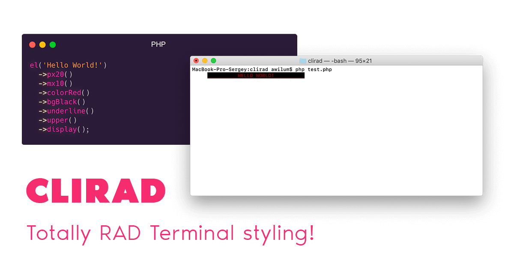

<br>

<p align="center">
<a href="https://github.com/clirad/clirad/releases"></a> <a href="https://github.com/clirad/clirad"></a> <a href="https://github.com/clirad/clirad"></a>  
</p>

<br>

Clirad provides a fluent and powerful, object-oriented interface for customizing CLI output text color, background, formatting, and more.

### Installation

#### With [Composer](https://getcomposer.org)

```
composer require clirad/clirad
```

### Documentation

### Tests

Run tests

```
./vendor/bin/pest
```

### License
[The MIT License (MIT)](https://github.com/clirad/clirad/blob/master/LICENSE)
Copyright (c) 2021 [Sergey Romanenko](https://awilum.github.io)
