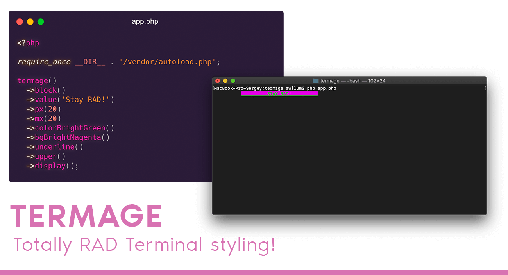

<br>

<p align="center">
<a href="https://github.com/termage/termage/releases"></a> <a href="https://github.com/termage/termage"></a> <a href="https://github.com/termage/termage"></a>  
    
</p>

<br>

Termage provides a fluent and incredible powerful, object-oriented interface for customizing CLI output text color, background, formatting, theming and more.

### Installation

#### With [Composer](https://getcomposer.org)

```
composer require termage/termage
```

### Resources
* [Documentation](https://digital.flextype.org/termage)

### Tests

Run tests

```
./vendor/bin/pest
```

### License
[The MIT License (MIT)](https://github.com/termage/termage/blob/master/LICENSE)
Copyright (c) 2021 [Sergey Romanenko](https://awilum.github.io)
