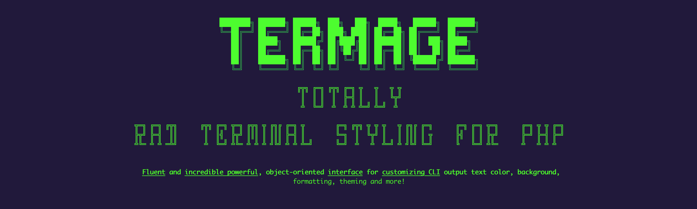

<br>

<p align="center">
 <a href="https://packagist.org/packages/thermage/thermage"></a>   <a href="https://hitsofcode.com"></a>
</p>

<br>

Thermage provides a fluent and incredibly powerful object-oriented interface for customizing CLI output text color, background, formatting, theming and more.

### Features

+ **Consistent colors**  
Thermage uses the ANSI color scheme which is widely used by terminals to ensure consistent colors in different terminal themes. If that’s not enough, Thermage can be used to access the full RGB color scheme (16+ million colors) in terminals that support TrueColor.

+ **Component system**  
Thermage consists of built-in components, called Elements, which can be used individually or together to generate pretty console output.

+ **Theming**  
Thermage provides ability to create and use custom themes to change the style of command line output with preconfigured themes variables.

+ **Shortcodes**  
Thermage provides incredible simple and powerful Shortcodes API to create and use shortcodes markup for customizing CLI output text color, background, formatting.

+ **Framework agnostic**  
Thermage can be used with any Modern PHP Framework: Symfony, Laravel, Yii, CakePHP, CodeIgniter, Phalcon and others.

### Installation

#### With [Composer](https://getcomposer.org)

```
composer require thermage/thermage
```

### Resources
* [Documentation](https://awilum.github.io/thermage)

### Tests

Run tests

```
./vendor/bin/pest
```

### License
[The MIT License (MIT)](https://github.com/thermage/thermage/blob/master/LICENSE)
Copyright (c) [Sergey Romanenko](https://github.com/Awilum)
