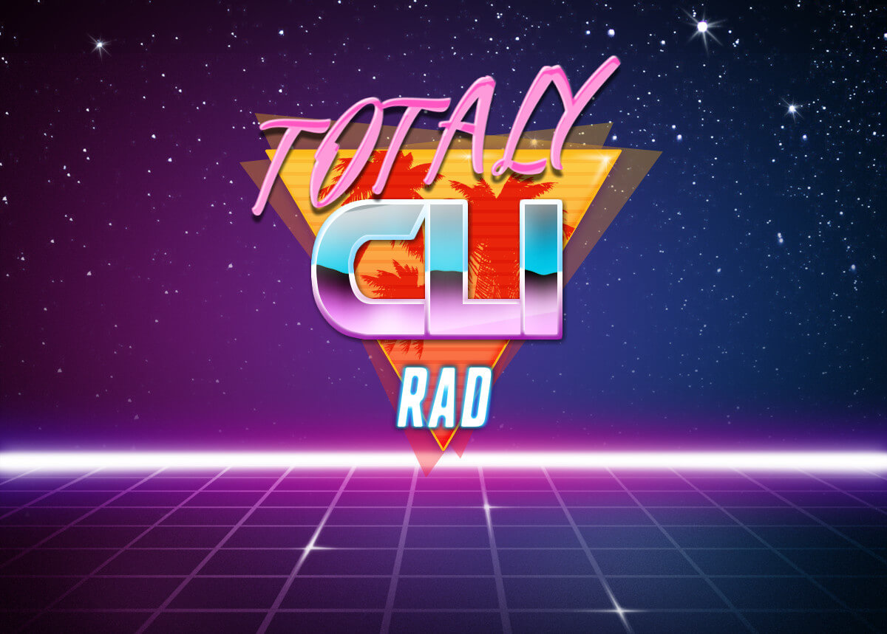

<p align="center">
<a href="https://github.com/clirad/clirad/releases"></a> <a href="https://github.com/clirad/clirad"></a> <a href="https://github.com/clirad/clirad"></a>   <a href="https://codeclimate.com/github/clirad/clirad/maintainability"></a>  <a href="https://app.codacy.com/gh/clirad/clirad?utm_source=github.com&utm_medium=referral&utm_content=clirad/clirad&utm_campaign=Badge_Grade"></a>
</p>

<br>

### Installation

#### With [Composer](https://getcomposer.org)

```
composer require clirad/clirad
```

### Resources
* [Documentation](https://digital.flextype.org/clirad)

### Tests

Run tests

```
./vendor/bin/pest
```

### License
[The MIT License (MIT)](https://github.com/clirad/clirad/blob/master/LICENSE)
Copyright (c) 2021 [Sergey Romanenko](https://awilum.github.io)
